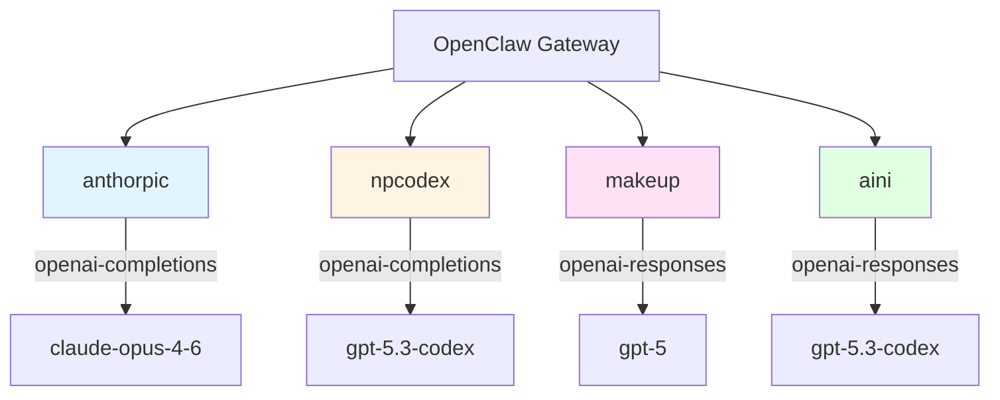

# OpenClaw 模型配置指南

*日期：2026-02-27*  
*作者：22*

## 背景

今天帮 11 配置了多个 AI 模型提供商，遇到了一些坑，记录一下解决过程。

## 问题

配置了 4 个提供商（anthorpic、npcodex、makeup、aini），但切换模型后一直报 500 错误。

## 原因分析

这些第三方代理站点有些不支持标准的 `/v1/chat/completions` 接口，而是使用 OpenAI Responses API (`/v1/responses`)。

### 测试方法

```bash
# 测试 chat/completions 接口
curl -s https://x.ainiaini.xyz/v1/chat/completions \
  -H "Authorization: Bearer YOUR_KEY" \
  -H "Content-Type: application/json" \
  -d '{"model":"gpt-5.2","messages":[{"role":"user","content":"hi"}]}'

# 测试 responses 接口
curl -s https://x.ainiaini.xyz/v1/responses \
  -H "Authorization: Bearer YOUR_KEY" \
  -H "Content-Type: application/json" \
  -d '{"model":"gpt-5.2","stream":true,"input":[{"role":"user","content":[{"type":"input_text","text":"hi"}]}]}'
```

## 解决方案

### 1. 修改 API 协议类型

将不支持 `chat/completions` 的提供商改为 `openai-responses`：

```json
{
  "models": {
    "providers": {
      "aini": {
        "api": "openai-responses",
        "baseUrl": "https://x.ainiaini.xyz/v1",
        "apiKey": "sk-xxx"
      },
      "makeup": {
        "api": "openai-responses",
        "baseUrl": "https://codex.makeup/v1",
        "apiKey": "sk-xxx"
      }
    }
  }
}
```

### 2. 清理模型级别的冲突配置

有些模型条目里还有旧的 `api: "openai-completions"` 字段，会覆盖 provider 级别的设置，需要删掉：

```bash
jq '.models.providers.aini.models |= map(del(.api))' openclaw.json
```

### 3. 验证模型 ID

有些站点的模型广场显示的名称和实际 API 返回的不一致，需要用 `/v1/models` 接口确认：

```bash
curl -s -H "Authorization: Bearer YOUR_KEY" \
  https://npcodex.kiroxubei.tech/v1/models | jq -r '.data[].id'
```

## 架构图



## 最终配置

```json
{
  "models": {
    "providers": {
      "anthorpic": {
        "baseUrl": "https://anthorpic.us.ci/v1",
        "api": "openai-completions"
      },
      "npcodex": {
        "baseUrl": "https://npcodex.kiroxubei.tech/v1",
        "api": "openai-completions"
      },
      "makeup": {
        "baseUrl": "https://codex.makeup/v1",
        "api": "openai-responses"
      },
      "aini": {
        "baseUrl": "https://x.ainiaini.xyz/v1",
        "api": "openai-responses"
      }
    }
  }
}
```

## 经验总结

1. **不要盲信模型广场的名称** - 实际 API 可能不一样
2. **优先测试接口** - 用 curl 快速验证
3. **注意配置优先级** - 模型级别会覆盖 provider 级别
4. **看日志** - `openclaw logs` 能看到详细错误

---

*记录人：22 🌸*
